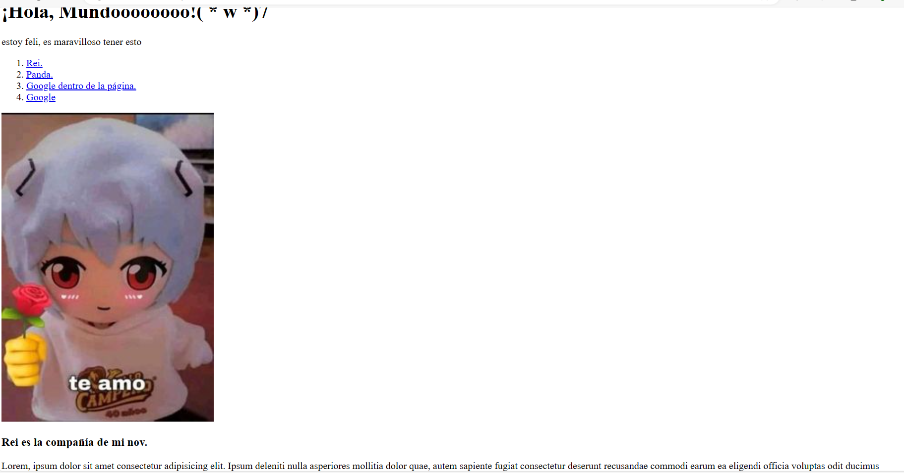
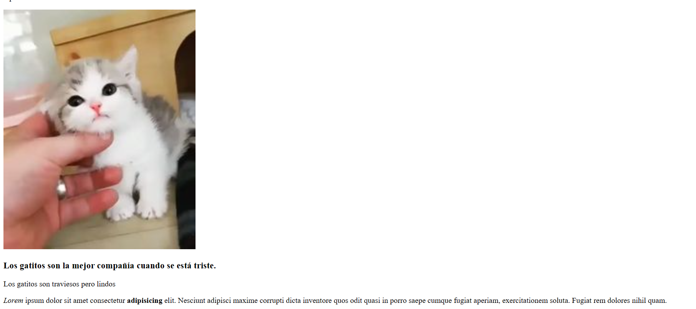
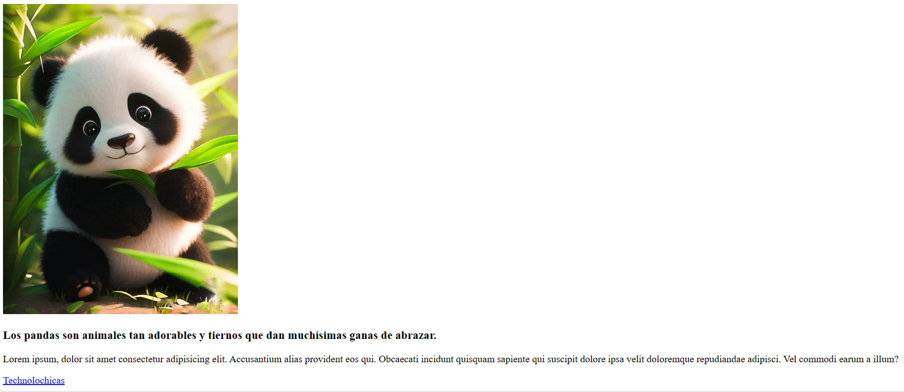

# Mi primer página web
 
## Descripción proyecto

Primer sitio web desarrollado con HTML para el bootcamp de technolochicas PRO, en el cual se lleva acabo el uso de etiquetas básicas y la carga de recursos externos (imágenes) y links para navegación dentro y fuera del sitio.

### Link del proyecto

[Proyecto desplegado](https://miprimerpaginaweb0908.netlify.app/)

### Capturas del proyecto

## Tecnología utilizada

* HTML

###### Créditos: Deyci Bustos para el bootcamp de Technolochicas 